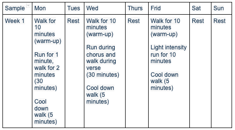
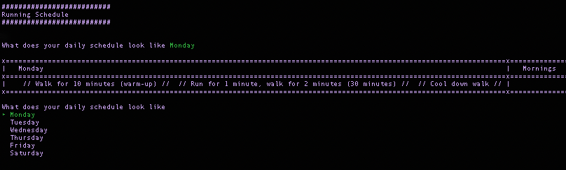
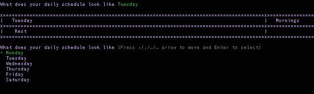
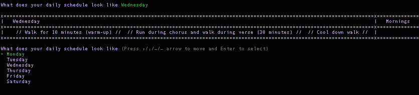
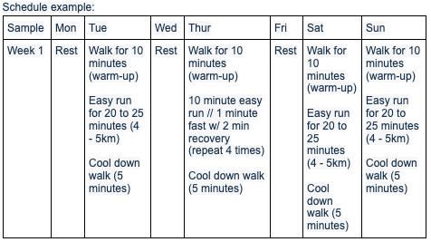
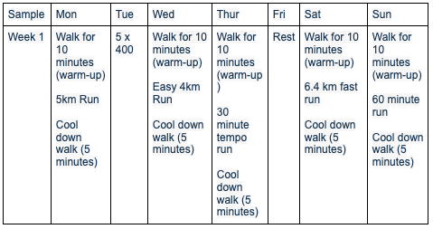
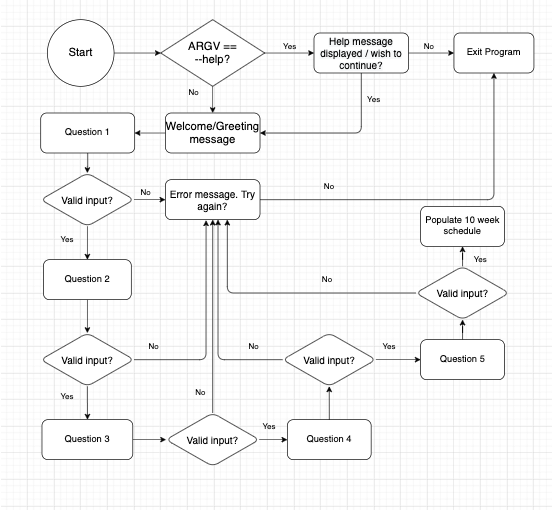
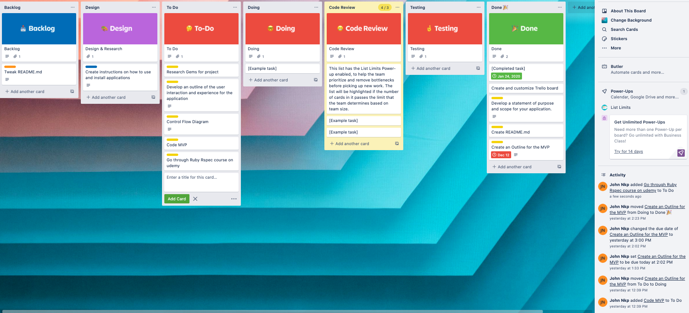
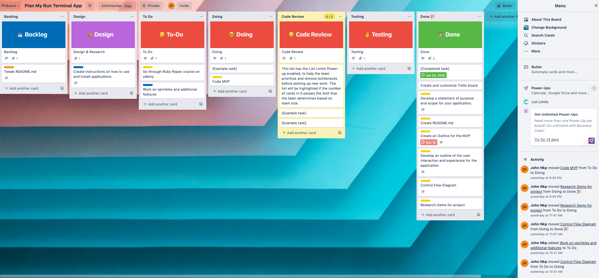
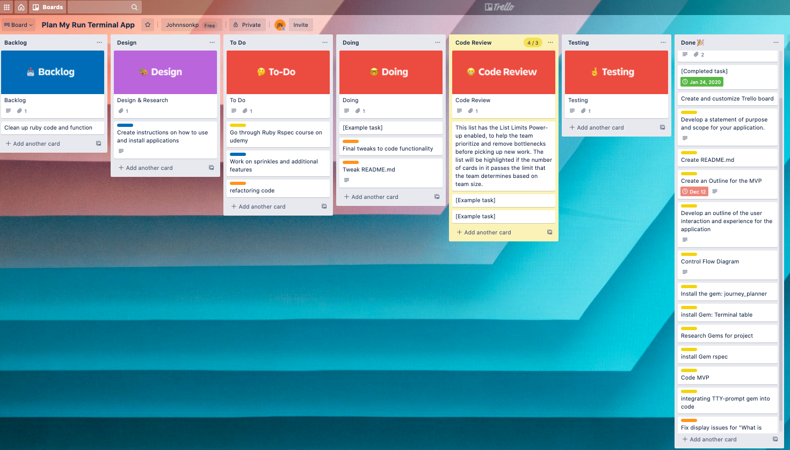

# T1A3 - Terminal Runner

## Github repo:
[Terminal Runner](https://github.com/Johnnsonkp/running-planner)

## _Purpose of the application_

Terminal Runner provides a weekly running schedule based on the users unique goal, availability and ability. The application also provides weekly reports and statistics centered around the users goal.
<br>
<br>

## _Why terminal runner?_

During the pandemic when gyms were shut down universally, people had to resort to other ways in order to keep fit. Running is the one full proof way to keep fit year round without paying a cent. All that is required is a good solid pair of runners and a large enough area or treadmill. 

Finding a time and a place to go for a run can be a headache, this app will take care of that. Providing a structured approach to running that encourages the user to stick to the plan in order to achieve he’s or her goal.
<br>
<br>

## _Target audience and application_

The target audience for this application is users who are 16 and above. The app has several settings, which cater to the users experience and abilities. 

An elderly lady for example in her late 60’s who lives a sedentary lifestyle will be classified as a beginner, (this is determined through a questionare which is taken by the user upon starting up the app).The app will then populate a schedule which incorporates medium to high intensity walks 3 - 4 days a week based on her availability.

Compared to an individual in he's early to mid 20's with an active lifestyle and a goal to lose weight and get toned. This user will be recognize as intermediate to advance and more taylored running plan that involves higher intensity and longer runs will be created for him.

Users who are deamed as advance/performance runners will have a more intense and longer running schedule.
<br>
<br>

## _Installation and dependencies_
- Ruby 2.7.2 required to run the application
- gem 'rspec'
- gem 'colorize', '~> 0.8.1'
- gem 'terminal-table'

To install the ruby gems run

```html 
gem install bundler 
``` 
The repo can be cloned by running this command on the terminal
```html 
git@github.com:Johnnsonkp/running-planner.git
```

## _Features_

- User personalised greeting/ User statistics
- Weekly running schedule planner based around the users ability and availability
- The main goal for these groups is improving their performance towards their desired goal.
- The runners goal is scooped from the input question and the plan is then altered to fit their unique requirements

- Three difficulty levels (beginner, intermediate, hard):
    ### 1. Beginner
    -   The main goal for the beginner program is to have them running 5km by the end of the 10 weeks.
    -   The emphasis for the beginner is not to monitor daily/ weekly km but rather focus on completing daily exercises
    -   lexibility is a huge component here, with only 3 workouts scheduled per week

    ### 2. Intermediate
    - The main goal for an intermediate runner is to progressively get faster during runs as well as keeping in shape and getting toned
    - The recommended weekly km is 14 - 16 km + 1 interval type workout in between
    - Structure is a huge component here, this planner will schedule the running workouts around the individuals schedule. Set days and time is key within the group of runners.

    ### 3. Advance
    - Recommended weekly km is anywhere from 20+ km and interval type workouts in between

<br>
<br>

## _Sprinkles_

- User specific goals outside the app scope
- Populated routes based on location - Routes visually displayed
- Full body workouts
- Daily Journey 
- Ability to check off runs 
<br>
<br>

## _User stories_
- As an athlete I want to have a structured workout planner that provides me with intense running workouts based upon my abilities and my goals. I would also like to have reports and statistics in regards to my runs.
- As a mum I want to have flexibility in my workout planner. I would also like to track my weight loss throughout the 10 weeks and be held accountable.
- As a 9-5er I want to have set days and time for my running workouts. I want to also like to have statistics on my runs.
<br>
<br>

## _MVP_

- Weekly running schedule planner based on availability and ability of the user
- Custom duration and intensity of runs based upon the users ability
- Statistics and reports about runs in relation to the users goals
- Weight entry section with weekly weigh in checks 
- Daily journaling
 <br>
 <br>

## Outline of the user interaction and experience for the application
<hr>

## Manual:

Upon starting up the app the user is met with a welcome message. Once the user creates an account or logs in they’re then met with  several input questions:
1. What is your name?
2. What is your goal? [ Weight loss, Get toned, Performance gains]
3. What is your experience? [ Beginner, Intermediate, Advance]
4. Are there any days you’re not free for a workout? 
5. What time of the day best suits your workouts? [ Morning, Afternoon, Evening]
<br>
<br>

## Beginner:
- The main goal for the beginner program is to have them running 5km by the end of the 10 weeks.
- The emphasis for the beginner is not to monitor daily/ weekly km but rather focus on completing daily exercises
- Flexibility is a huge component here, with only 3 workouts scheduled per week


### Beginner schedule (Monday)

### Beginner schedule (Tuesday)

### Beginner schedule (Wednesday)

<br>
<br>

## Intermediate:
- The main goal for an intermediate runner is to progressively get faster during runs as well as keeping in shape.
- The recommended weekly km is 14 - 16 km + 1 interval type workout in between
- Structure is a huge component here, this planner will schedule the running workouts around the individuals schedule. Set days and time is key within the group of runners.


<br>
<br>

## Advance:
- The main goal for this groups is improving their performance towards their desired goal.
- The runner's goal is scooped from the input question and the plan is then altered to fit their unique requirements.
- Recommended weekly km is anywhere from 20+ km and interval type workouts in between.


<br>
<br>

## Error handling

<br>
<br>

## Control flow diagram


<br>
<br>

## Implementation plan

[Terminal Runner Trello board](https://trello.com/b/FAijcuwF/plan-my-run-terminal-app)






